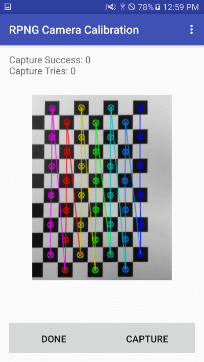
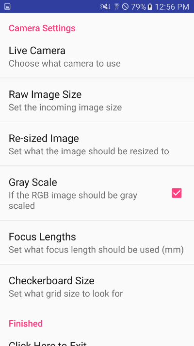
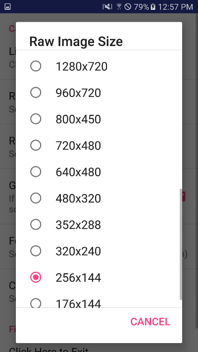
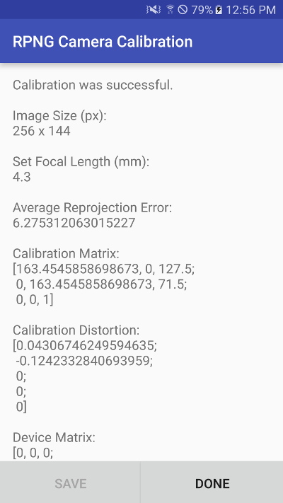

# Android Camera Calibration

This android app allow for calibration of a mobile camera. Currently OpenCV does not support opening of the api `camera2` objects. Meaning that the default OpenCV java view will not work with the newest phone on the market. In this app we use only the camera2 api to first capture the image, convert it into an OpenCV format and then process it using the native OpenCV methods. This seems to have a lot of overhead so in many cases the framerate is very low.

A bit of overview of the folder and files in this repository. This uses the gradle experiential branch so that the android ndk format is supported for native debugging in android studio. To open this project, just load up android studio, and go `File > Open...`. Select this repository folder (not a sub-folder in this repository) and the project should automatically open and download all needed sdk and libraries. It will ask you to download the ndk if it is not installed already on your machine.

## Features

* Camera calibration using the opencv package
    * Uses the `findCirclesGrid` method
    * Most code was taken from the opencv calibration example
* Very nice setting panel that allow selection of:
    * Active camera
    * Image size
    * Resized
    * Focus length
    * Grid size
* Nice display of calibration matrix with root mean squared error
* TODO: Need to still implement saving of the calibration info
* TODO: For now calibration info is just displayed so that the user can copied it down

## Layout

The main application is located in the `/app/` folder and has its own gradle.build. This file instructs the gradle build system how to make this project and what libraries it depends on, more on these libraries later. Inside the `/libraries/` folder all external libraries are placed. A custom gradle.build has been made for each of these on how to build it. The most important one is `opencv_310` which stands for the OpenCV library version 3.10.

Inside this folder, we can see that the build.gradle is telling the system to build it as a library. Now there are a couple important folders that android studio automatically looks for. The `aidl`, `java`, `jni`, `jniLibs` folders are all keyword folders that are looked for. Inside the aidl is a auto generated file, inside the java folder is the java bindings for opencv (these are copied from the opencv android sdk `/sdk/java/` folder), inside the jni are the linking java files that point to the c++ methods (copied from `/sdk/native/jni/` folder) and finally inside the jniLibs folder are the actual compiled c++ libraries for opencv (copied from `/sdk/native/libs/` folder). The opencv library is linked into the build system in the settings.gradle file, where we specify the library name `opencv_310` and where it is located from the root directory `libraries/opencv_310/`. This step is important since we have stored the libraries in a subdirectory we can not just specify the library name and have it be found.

For the actual program there are 3 activities. The main on has the camera view. On launch this one is created, and instantly launches the settings activity. This is a `PreferenceActivity` hands off the view and settings loading to the android api. This is really nice since after each setting is edited the "shared preference" for this application gets updated. The actual main activity has the camera render, and the capture/done buttons. To save the extracted grid, the capture button can be used. After enough has been captured, the done button can be pressed. This launches the results activity which starts an async thread, which displays a proccessing dialog, and then the calculated results.

## Calibration Grid

The [default](app/src/main/java/io/rpng/calibration/managers/CameraCalibrator.java#L145-L149) grid is a cirlce grid.
An example that can be printed out on a sheet of 8.5"x11" paper can be seen below.
This grid would be classified as either a *11x8* or *8x11* grid pattern.

## Screenshots

